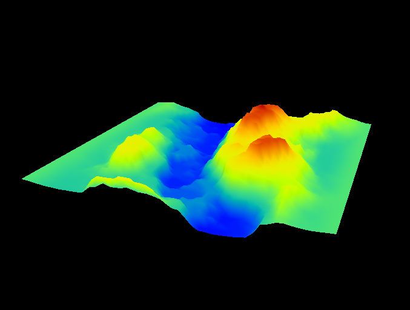

# Digital Earth Model Visualisation

## Overview
This program is designed to visualize terrain models from OBJ files. It provides different modes to represent the model, including grid, hillshade, and colored heightmap. Users can interact with the model through various mouse controls to zoom and rotate the terrain.

## Features

Model Display Modes:
- Grid model
- Hillshade model
- Heightmap model

Mouse Controls:
- Right Mouse Button (RMB): Zoom in and out
- Left Mouse Button (LMB): Rotate the model

## Usage Instructions

Start the Program: Run the executable SLN file to launch the terrain visualization program.

Select Display Mode:
- Press 1 to display the model as a grid model.
- Press 2 to display the model with hillshade.
- Press 3 to display the model with color heightmap.

Interact with the Model:
- Use the Right Mouse Button (RMB) to zoom in and out of the model.
- Use the Left Mouse Button (LMB) to rotate the model.

## Models 
### Grid model
The grid model representation is a way to visualize the terrain using lines to connect vertices, forming a mesh. This mode helps in understanding the underlying structure of the terrain by highlighting the edges and vertices without any surface rendering. The grid model provides a clear view of the topology, making it easier to analyze the geometric properties of the terrain.
 

### Hillshade model
The Hillshade Model mode simulates lighting and shadow effects on the terrain, providing a more realistic visualization by showing how the terrain might appear under sunlight. This mode helps in understanding the topographical features and the impact of light and shadow.
 

### Heightmap model
The Heightmap Model mode uses colors to represent different elevations on the terrain. Lower elevations are shown in cooler colors (like blue or green), while higher elevations are shown in warmer colors (like red or yellow). This mode is useful for quickly identifying the elevation profile of the terrain.
 
